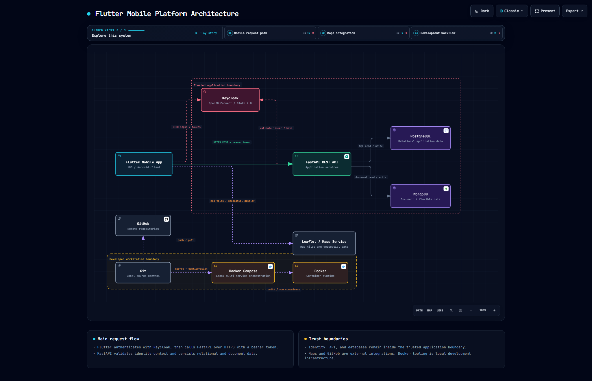

## Arquitectura de la aplicación móvil

[Abrir diagrama interactivo](https://jffa25.github.io/Practicas_Integradora_230417/architecture-mobile-platform.html)

## Descripción — Arquitectura de la Plataforma Móvil Flutter

El diagrama ilustra la arquitectura de la aplicación móvil Flutter (iOS/Android), mostrando el flujo principal de peticiones: la app se autentica contra Keycloak (OpenID Connect / OAuth 2.0) y consume la API REST FastAPI vía HTTPS con bearer token. FastAPI, a su vez, persiste datos relacionales en PostgreSQL y datos de documentos flexibles en MongoDB.

Se distinguen dos límites de confianza: el "Trusted application boundary", que agrupa la identidad (Keycloak), la API (FastAPI) y las bases de datos; y el "Developer workstation boundary", con las herramientas de desarrollo local (Git, Docker Compose, Docker) usadas para construir y ejecutar los contenedores, además del control de versiones vía GitHub (push/pull). Como integración externa, la app también consume un servicio de mapas (Leaflet) para mostrar datos geoespaciales.